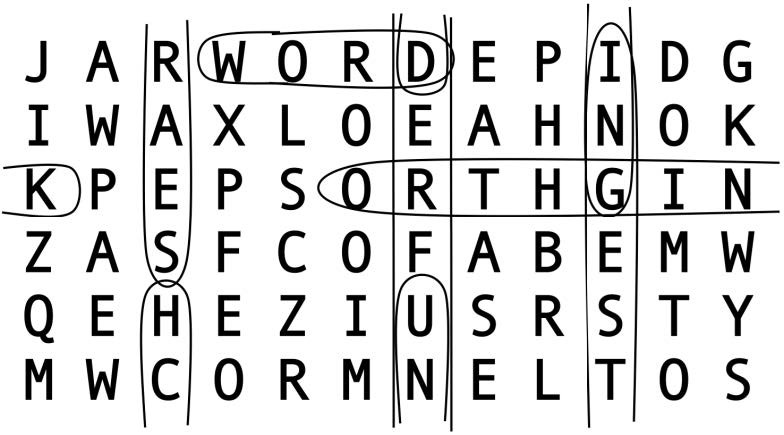
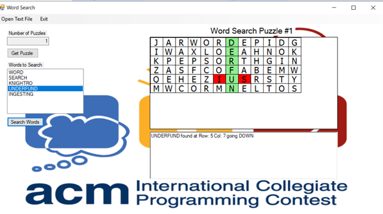

---

# ACM Warrior Word Search
[](https://github.com/code-logik/acm-warrior-word-search?tab=MIT-1-ov-file#)
[](https://commonmark.org/)
[](https://github.com/RichardLitt/standard-readme)
[](https://www.microsoft.com/en-us/sql-server/sql-server-2022)
[](https://visualstudio.microsoft.com/)
[](https://dotnet.microsoft.com/)
[](https://learn.microsoft.com/en-us/dotnet/csharp/)
[](https://learn.microsoft.com/en-us/dotnet/desktop/wpf/advanced/xaml-in-wpf?view=netframeworkdesktop-4.8)
[](https://www.adobe.com/products/photoshop.html)

ACM International Collegiate Programming Contest Adaptation  
Windows Programming Final Exam Alternative  
<br>
Mark Sarasua, Jr.  
Rad Alrifai, Ph.D.  
CS 4253  
Northeastern State University  
<br>
<a href="https://code-logik.com/CS4253/FinalExam/ACM_Final_Exam_Problem.mp4" target="_blank">ACM Warrior Word Search Demo</a>  
<br>
## Table of Contents  
1. [Requirements](#requirements)
2. [Rubric](#rubric)
3. [Search Cross Word Problem](#search-cross-word-problem)
4. [Source Build](#source-build)<br><br>

## Requirements  
Adapt the ACM Search Cross Word Problem to incorporate a Graphic User Interface and Puzzle Database to demonstrate comprehensive mastery of CS 4253 Windows Programming.  
- **Language:** C#
- **UI Framework:** WPF .NET 
- **Database:** Microsoft SQL Server
- **Paradigm:** Object-Oriented
- **Presentation:** In-Class Demonstration Required<br><br>

## Rubric  
Code and User Interface Criteria:
- Produces consistent and accurate input/output results: 40%.
- Concise, non-repetitive code using advanced syntax and exception handling: 20%.
- Graphical User Interface is both aesthetically pleasing and functional: 20%.
- Consistent database connectivity and reliable data retrieval: 20%.<br><br>

## Search Cross Word Problem  
(*Difficulty Level*: Medium)  
<br>
  
<br>
A word search puzzle is a grid of letters where your challenge is to find selected words as formed
by consecutive letters in a line along the rows, columns, or diagonals of the grid. Tougher word
searches also allow words in the grid to be forwards or backwards in any of those directions. In
the “loopy word search,” we will also allow words to go off the edge of the grid and continue
(along the same line) on the other side, and potentially even reuse letters from that same word.    
<br>
However, in this problem, we won’t search for words along diagonal lines, i.e., we only 
search along the rows and columns. (The UCF programming coaches are sure nice!)  
<br>
**The Problem:**  
Given a grid of letters and a list of words, identify the location of the first letter of each word in
the grid and the direction in which the remaining letters of the word can be found in the sequence.  
<br>
**The Input:**  
The first input line contains a positive integer, n, indicating the number of word search puzzles. This is followed by the data for these puzzles. The first input line for each puzzle contains two positive integers (separated by a space): r, the number of rows in the grid (between 3 and 12 inclusive), and c, the number of columns in the grid (between 3 and 20 inclusive). Each of the next r input lines for the puzzle contains exactly c uppercase letters, with no spaces. The next input line for each puzzle contains a positive integer s, the number of words to search for. Each of the next s input lines contains a string of uppercase letters (length between 3 and 100 letters, inclusive) which is a word to search for. It is not necessarily a real word in any language. Each of the s words will appear exactly once in the grid, meaning it has exactly one starting location and goes only in one direction. None of the words will be palindromes (same letters backwards and forwards). Assume that the input is valid as described here.  
<br>
**The Output:**  
For each word search puzzle, output the line “Word search puzzle #p:” where p is the puzzle number (counting from 1 in the input). Then, for each word given in that puzzle (and in the order given), output a line of the form “d r c w” where w is the word, r is the row in the grid where the first letter of the word is located (counting from 1), c is the column in the grid where the first letter is located (counting from 1), and d is the direction where the remaining letters of the word can be found, relative to the first letter, as given below. Output exactly one space after each of d, r, and c. For the direction d, use the following 1-letter codes:  
<br>
Code Use for words with letters:  
- "R" in the same row that go to the right, into subsequent columns, potentially wrapping to the first column of the same row.
- "D" in the same column that go down, into subsequent rows, potentially wrapping to the first row of the same column.
- "L" in the same row that go left, back into previous columns, potentially wrapping to the last column of the same row.
- "U" in the same column that go up, into previous rows, potentially wrapping to the last row of the same column.  

Leave a blank line after the output for each puzzle.  
<br>
**Sample Input:**  
```
2  
6 12  
JARWORDEPIDG  
IWAXLOEAHNOK  
KPEPSORTHGIN  
ZASFCOFABEMW  
QEHEZIUSRSTY  
MWCORMNELTOS  
5  
WORD  
SEARCH  
KNIGHTRO  
UNDERFUND  
INGESTING  
3 7  
UCFAEHT  
KNIGHTS  
CODETRY  
2  
AGE  
THETHETHETHETH  
```
[]()  

**Sample Output:**  
```
Word search puzzle #1:  
R 1 4 WORD  
U 4 3 SEARCH  
L 3 1 KNIGHTRO  
D 5 7 UNDERFUND  
D 1 10 INGESTING  
Word search puzzle #2:  
D 1 4 AGE  
U 3 5 THETHETHETHETH  
```
[]()  

**Adaptation Example:**  
  
<br><br>

## Source Build  
Prerequisites:  
- Microsoft SQL Server
- Microsoft SQL Server Management Studio (SSMS)
- Visual Studio 2022<br><br>

To build from source code:  
1. Clone the main branch to your local machine.
2. Navigate to the src directory.
3. Execute the file ACMFinalExamProblem_SQL.sql with Microsoft SQL Server Management Studio (SSMS).
4. Navigate to the ACMFinalExamProblem subdirectory.
5. Open the ACMFinalExamProblem.sln in Visual Studio 2022.
6. Build Solution using *Release* and *Any CPU* settings.
7. Navigate to the Release folder to find the ACMFinalExamProblem.exe.

---
